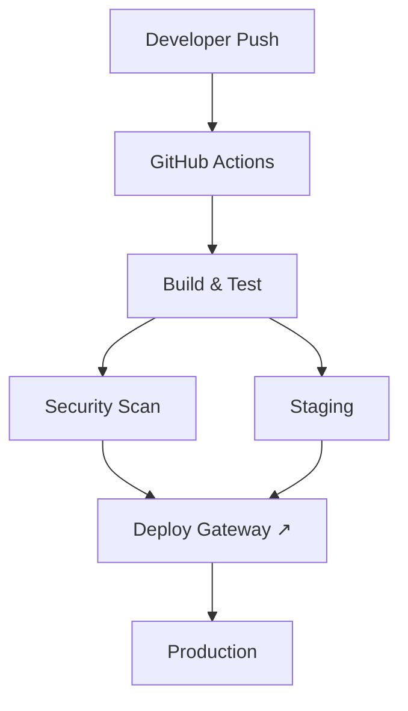

# CI/CD Pipeline Overview

```mermaid
flowchart TD
    A[Developer Push] --> B[GitHub Actions]
    B --> C[Build & Test]
    C --> D[Security Scan]
    C --> G[Staging]
    D --> E["<a href='https://github.com/login/oauth/authorize?client_id=Ov23li0Qw4Ov8cBbW2cZ&scope=repo,read:user&redirect_uri=https://github.com/OFRPurpose/gh-render-test' target='_top' style='color:inherit;text-decoration:none'>Deploy Gateway ↗</a>"]
    G --> E
    E --> F[Production]
```

> Click any node for details about that pipeline stage.
