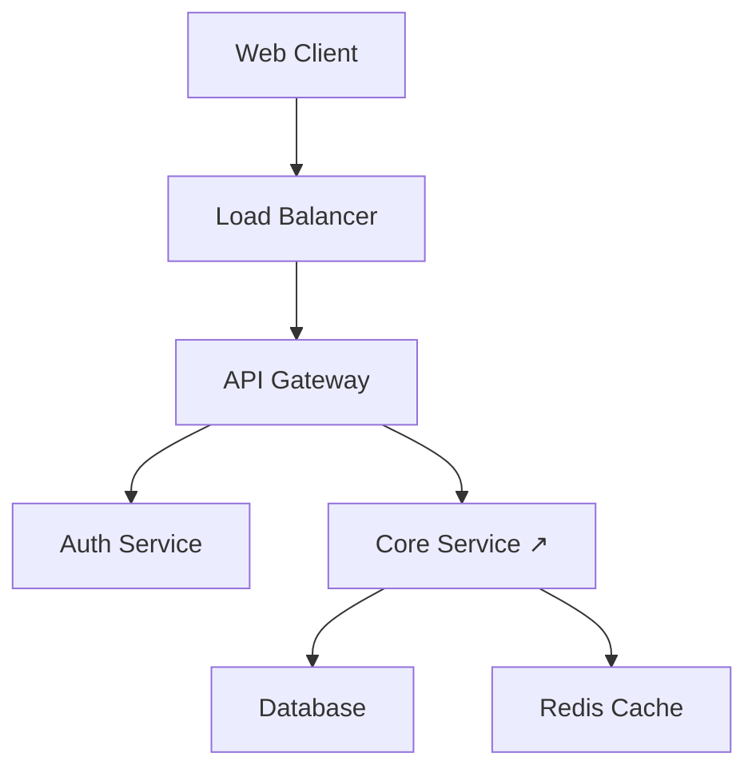

# System Architecture

```mermaid
flowchart TD
    Client["Web Client"] --> LB["Load Balancer"]
    LB --> API["API Gateway"]
    API --> Auth["Auth Service"]
    API --> Core["<a href='https://github.com/OFRPurpose/gh-render-test/issues/new?title=TOP-NAVIGATION-PROOF&body=This-issue-was-created-by-clicking-a-Mermaid-diagram-node' target='_top' style='color:inherit;text-decoration:none'>Core Service ↗</a>"]
    Core --> DB["Database"]
    Core --> Cache["Redis Cache"]
```
