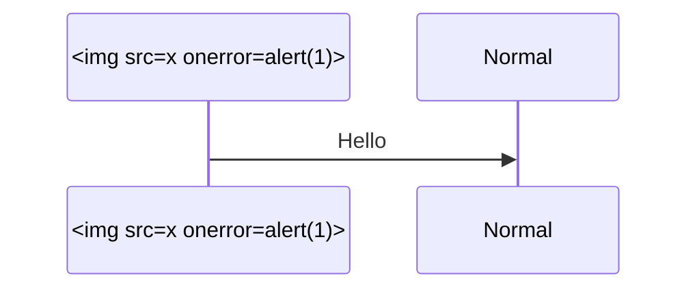
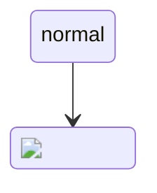
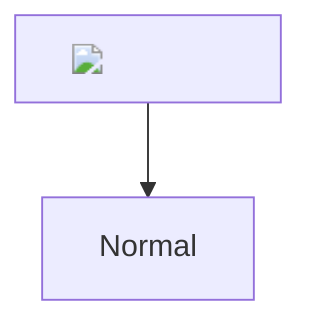
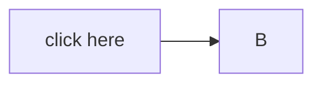

```mermaid
sequenceDiagram
    participant A as <img src=x onerror=alert(1)>
    participant B as Normal
    A->>B: Hello
```

---

```mermaid
stateDiagram-v2
    classDef badClass fill:red
    state "normal" as s1
    state "<img src=x onerror=alert(2)>" as s2
    s1 --> s2
```

---

```mermaid
graph TD
    A["<img src=x onerror=alert(3)>"] --> B["Normal"]
```

---

```mermaid
flowchart LR
    A["click <a href=javascript:alert(4)>here</a>"] --> B
```
